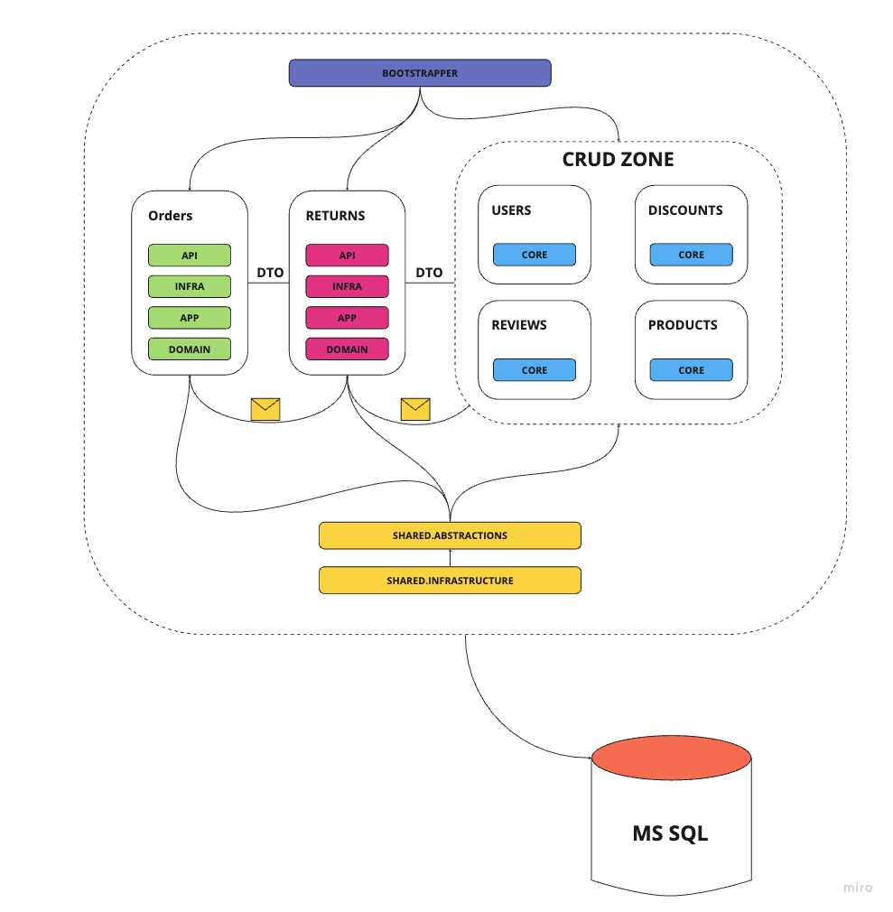

# Ecommerce Web Api

Project created to study and practice modular monolith and DDD concepts.

[Here](https://miro.com/app/board/uXjVMy3rVUc=/?share_link_id=104061673349) you can find miro board with Event Storming session.

## Architecture


## Technologies
.NET 7, Docker, MS SQL, xUnit, Travis CI

## How to run
```bash
docker-compose up
cd src/Bootstrapper/Ecommerce.Bootstrapper
dotnet run
```